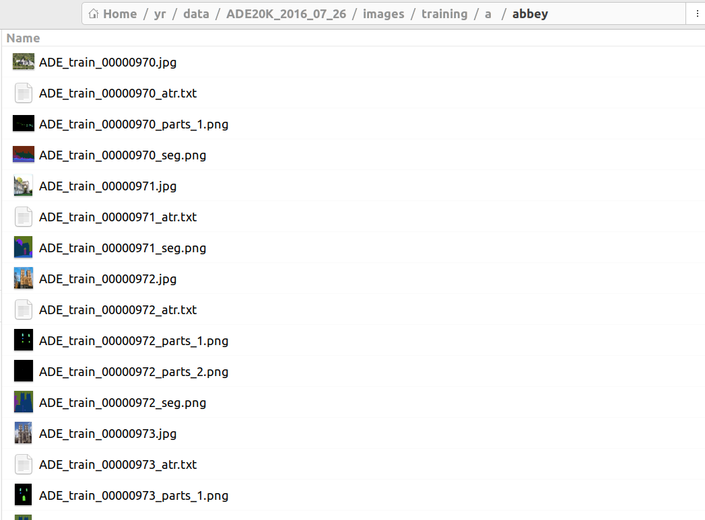

# 需求1
## 目标：

用ADE20K数据集，基于DINOv3模型，微调一个语义分割模型，参考example/segment_train_val/segment_train.py代码，完成训练与推理代码

## 数据集：

ADE20K数据集，

训练集路径：/home/yr/yr/data/ADE20K_2016_07_26/images/training，

验证集路径：/home/yr/yr/data/ADE20K_2016_07_26/images/validation

数据结构：

参考上面的图片，training和validation下面分别存储了训练的验证的图像以及标签

每幅图像下的文件

\* . jpg：RGB图像。

\* _seg.png：对象分割掩码。此图像包含有关对象类分割掩码的信息，还将每个类分隔为实例。通道R和G编码对象类掩码。通道B对实例对象掩码进行编码。loadAde20K的函数。m提取两个掩模。

\* _seg_parts_N.png：零件分割掩码，其中N是一个数字(1,2,3，…)，表示零件层次结构中的级别。部件被组织在一个树中，其中对象由部件组成，部件也可以由部件组成，部件的部件也可以有部件。level N表示部件树中的深度。级别N=1对应于对象的各个部分。所有的部件分割都具有与对象分割掩码相同的编码，类在RG通道中编码，实例在B通道中编码。使用loadAde20K函数。提取部分分割掩码，并将同一类的实例分离。

\* _.txt：描述每个图像(描述对象和部件)内容的文本文件。此信息与其他文件是冗余的。但另外还包含有关对象属性的信息。loadAde20K的函数。m还解析这个文件的内容。文本文件中的每一行包含:列1=实例号，列2=部件级别(对象为0)，列3=遮挡(true为1)，列4=类名(使用wordnet解析)，列5=原始名称(可能提供更详细的分类)，列6=逗号分隔的属性列表。

## DINOv3预训练模型

预训练模型路径：/home/yr/yr/code/cv/large_models/dinov3_all/dinov3-vits16-pretrain-lvd1689m